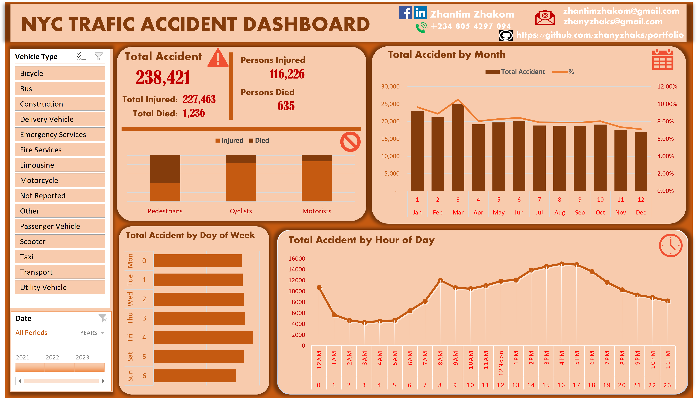

# 🚦 NYC Traffic Accident Dashboard

## 📌 Project Overview
This project presents an interactive data analytics dashboard analyzing New York City traffic accidents. The dashboard provides insights into accident trends, casualties, time-based patterns, and vehicle involvement to support data-driven decision-making in road safety, urban planning, and public policy.

---

## 🎯 Objectives
- Analyze total traffic accidents in New York City  
- Examine the number of injuries and fatalities  
- Identify high-risk periods by month, day, and hour  
- Compare accident impact across pedestrians, cyclists, and motorists  
- Enable filtering by vehicle type and date range  

---

## 📊 Key Metrics Summary
| Metric | Value |
|------|------|
| Total Accidents | 238,421 |
| Total Injured | 227,463 |
| Total Deaths | 1,236 |
| Persons Injured (Filtered) | 116,226 |
| Persons Died (Filtered) | 635 |

---

## 🧩 Dashboard Components

### 1️⃣ Vehicle Type Filter
Allows filtering accident records by vehicle categories such as:
- Passenger Vehicles  
- Motorcycles  
- Bicycles  
- Buses  
- Emergency and Utility Vehicles  
- Taxis and Commercial Vehicles  

This enables focused analysis of accident patterns by vehicle type.

---

### 2️⃣ Accident Impact by Road User
Compares accident outcomes among:
- Pedestrians  
- Cyclists  
- Motorists  

Each category is analyzed based on:
- Number of injured persons  
- Number of fatalities  

**Insight:** Motorists record the highest injuries, while pedestrians show relatively higher fatality risk.

---

### 3️⃣ Monthly Accident Trend
Displays total accidents by month with a percentage trend line.

**Key Observations:**
- Peak accidents occur around March  
- Gradual decline toward the end of the year  
- Seasonal effects likely influence accident frequency  

---

### 4️⃣ Accident Distribution by Day of Week
Shows how accidents are spread across the week:
- Friday records the highest accident count  
- Sunday has relatively fewer accidents  

This suggests weekday commuting significantly contributes to traffic incidents.

---

### 5️⃣ Accident Pattern by Hour of Day
Reveals clear time-based risk patterns:
- Lowest accidents: 2AM – 5AM  
- Morning rise: 7AM – 9AM (rush hours)  
- Peak accidents: 3PM – 6PM  
- Decline after 7PM  

---

## 🗓️ Date Range Filter
Supports multi-year analysis:
- 2021  
- 2022  
- 2023  

Users can dynamically adjust the date range to observe trends over time.

---

## 🛠️ Tools & Technologies
- Data Visualization: Microsoft Excel  
- Data Source: Maven Analytics - NYC Traffic Accident Dataset  
- Analysis Techniques: Aggregation, DAX, time-series analysis, categorical comparison  

---

## 📷 Dashboard Preview

---

## 🔍 Key Insights
- Traffic accidents are strongly time-dependent  
- Evening rush hours pose the highest risk  
- Motorists account for most injuries  
- Pedestrians are more vulnerable to fatal outcomes  
- Seasonal and weekday patterns significantly influence accident frequency  

---

## 📈 Use Cases
- Road safety assessment  
- Urban transportation planning  
- Public health and emergency response analysis  
- Data analytics portfolio demonstration  

---

## 👤 Author
**Zhantim Zhakom**  
Email: zhantimzhakom@gmail.com  
GitHub: https://github.com/zhanyzhaks/portfolio  
Phone: +234 805 4297 094  

---

## 📄 License
This project is for educational and portfolio purposes. Data usage complies with public dataset guidelines.
